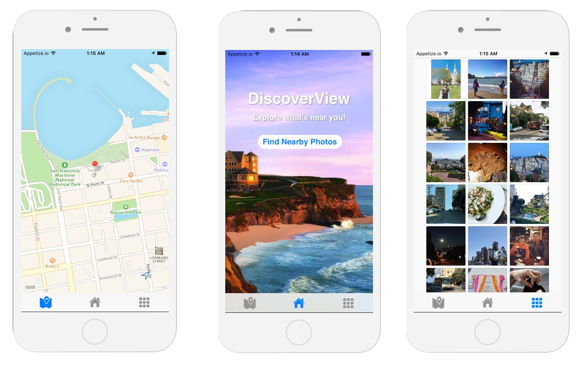

# **DiscoverView**

[DiscoverView](https://jastack.github.io/demo_page/) is a mobile application built on React Native which displays the most recent Instagram photos from a given location. A user can either view photos based on their current location, or drop a pin on a map and see the most recent photos near the pin.

## Features

 - Displays user’s current location
 - Displays photos with location coordinates near user
 - A user can set pins anywhere and view photos from near that location
 - Displays photo locations as pins on a map
 - Save photos to camera roll
 - View photos on Instagram

## Technologies and Methodology

 - React Native
   - This app was built entirely in React Native. Created by Facebook, React Native lets you build apps for both Android and iOS using only Javascript and the React framework.
 - React Native Maps
    - React Native Maps is a React component built by AirBnb. It gives the app map access.
 - Instagram API
   - Each pin drop is one query to the Instagram API, which searches for the 100 most recent photos within 100 meters of the dropped pin.

## Future Features
The App is fully functional and useful as it now exists. However there are a few additional features we could add going forward.

- Add button to click on pin in maps and see photos directly associated with that pin.
- Add option to save coordinates with photo when saving to phone, so a user can know where the picture was taken (if saved on phone).
- Pull in photos from more sources than Instagram (google places, flickr)
